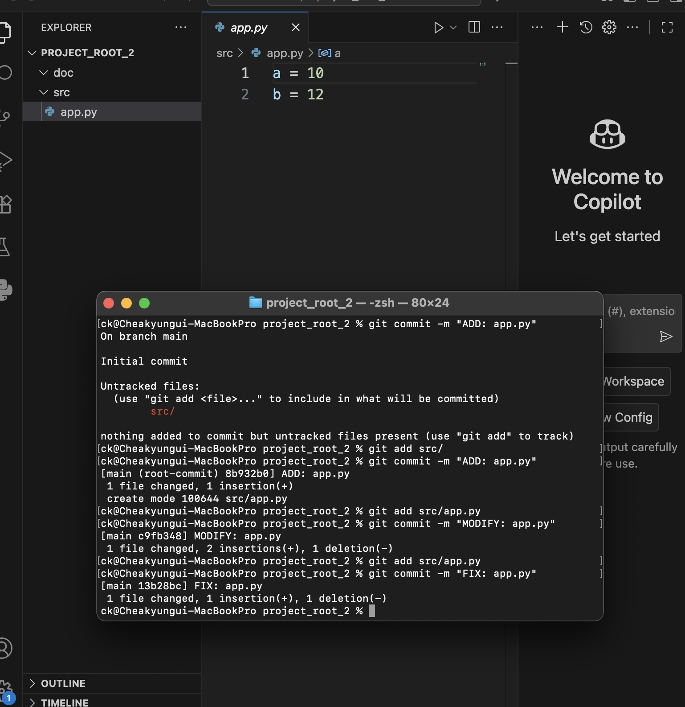
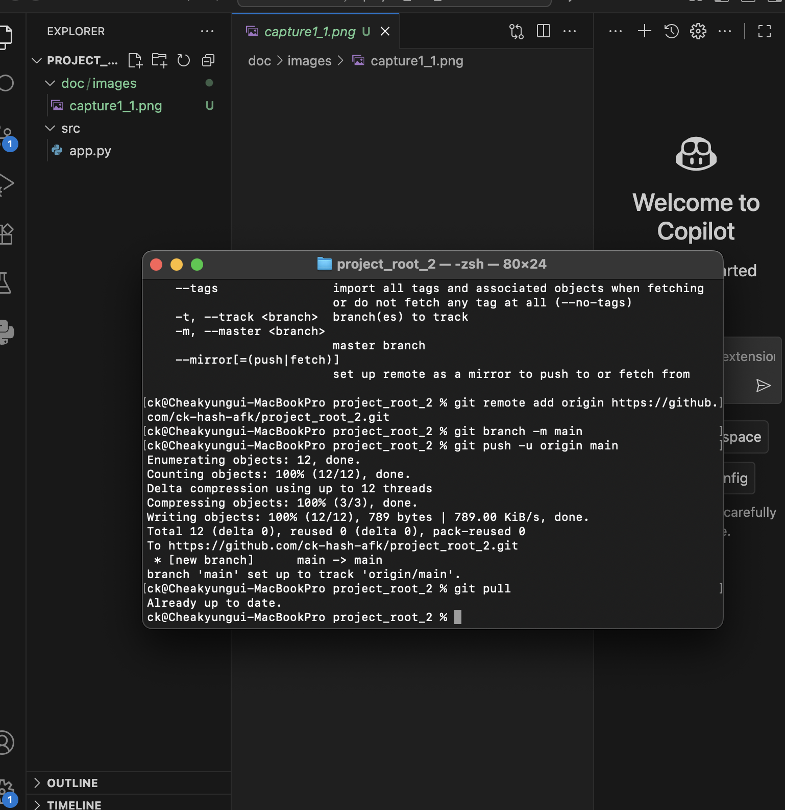

# Python GitHub 과제

## 1. 과제 개요
- VS Code에서 Python 프로젝트를 생성하고 Git/GitHub을 활용하여 버전 관리 및 저장소 연동을 실습한다.  
- commit 메시지 규칙:  
  - 첫 번째: `ADD: app.py`  
  - 이후 기능 추가: `MODIFY: app.py`  
  - 코드 수정: `FIX: app.py`  

---

## 2. 프로젝트 폴더 구조
```
project_root/
 ├─ src/
 │   └─ app.py
 ├─ doc/
 │   └─ images/
 │       ├─ capture1.png
 │       └─ capture2.png
 └─ README.md
```

---

## 3. 수행 과정
1. **src/app.py 작성 및 첫 commit**
   - commit 메시지: `ADD: app.py`  
   - 기능: [a = 10]  

2. **두 번째 commit**
   - commit 메시지: `MODIFY: app.py`  
   - 수정/추가한 내용: [b = 10]  

3. **세 번째 commit**
   - commit 메시지: `FIX: app.py`  
   - 수정/추가한 내용: [a = 11]  

---

## 4. 캡처 이미지
- `capture1_1.png` → commit 완료 상태 화면  
- `capture2_1.png` → GitHub push → pull 후 VS Code 화면  

예시:  
  
  

---

## 5. GitHub Repository URL
- URL: [https://github.com/ck-hash-afk/project_root_2/tree/main]  

---

## 6. 느낀 점 (선택 사항)
- 이번 과제를 하면서 배운 점: 여러가지 git 명령어들을 배워 sorce tree가 아닌 터미널에서 명령어를 통해 스테이지에 올리기와 커밋을 하는 방법을 알게되었다.
- Git/GitHub을 활용하며 어려웠던 점: 아무래도 예시 같은게 없다보니 내가 하고있는게 맞는지 모르겠다는 느낌이 계속 들었다. 또한 git을 처음 써보기 때문에 새로운 폴더를 만들면 git init을 해야한다는 점과 git hub에 push를 하려면 git remote add origin 과 같은 명령어를 써야 한다는 내용을 책에 나와있지 않아 큰 어려움이 있었다. 이런 명령어 뿐만이 아니었기 때문에 책만 의지 하고는 절대 과제를 해결하지 못한다는 큰 깨달음을 얻었다.,
- 앞으로 더 해보고 싶은 것: 더욱 많은 명령어들을 배워 활용해보고싶다.
